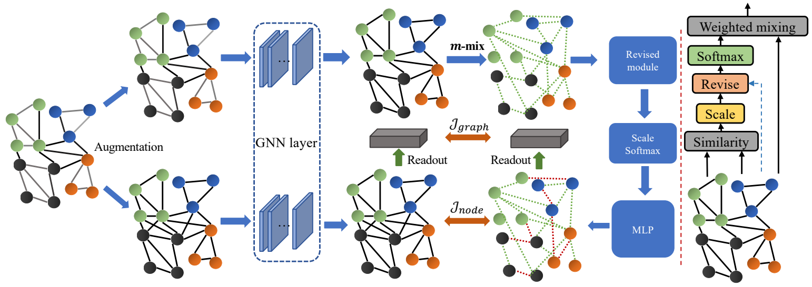

# M-Mix: Generating Hard Negatives via Multi-sample Mixing for Contrastive Learning

Code of SIGKDD 22 paper "[M-Mix: Generating Hard Negatives via Multi-sample Mixing for Contrastive Learning](https://sherrylone.github.io/assets/KDD22_M-Mix.pdf)"



This paper proposes to mix multiple samples in one mini-batch to generate hard negative pairs.

To pre-train the encoder on CIFAR-10 and CIFAR-100, run:
```
python main.py --dataset cifar10 (cifar100) --threshold 0.9
```
The config `--threshold 0.9` is used for selecting negative samples to mix.

For graph and node classification. Run: 
```
python main.py
```
You should download the dataset by yourself.
